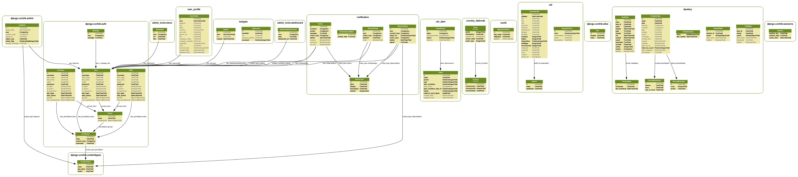

.. _objects-description:

Objects Description
===================

.. automodule:: cdr.models

.. _Switch-model:

:class:`Switch`
---------------

.. autoclass:: Switch
    :members:

.. _HangupCause-model:

:class:`HangupCause`
--------------------

.. autoclass:: HangupCause
    :members:

.. automodule:: user_profile.models

.. _UserProfile-model:

:class:`UserProfile`
--------------------

.. autoclass:: UserProfile
    :members:

.. automodule:: cdr_alert.models

.. _Alarm-model:

:class:`Alarm`
--------------

.. autoclass:: Alarm
    :members:

.. _AlertRemovePrefix-model:

:class:`AlertRemovePrefix`
--------------------------

.. autoclass:: AlertRemovePrefix
    :members:

.. _AlarmReport-model:

:class:`AlarmReport`
--------------------

.. autoclass:: AlarmReport
    :members:

.. _Blacklist-model:

:class:`Blacklist`
------------------

.. autoclass:: Blacklist
    :members:

.. _Whitelist-model:

:class:`Whitelist`
------------------

.. autoclass:: Whitelist
    :members:

.. automodule:: voip_billing.models

.. _VoIPPlan-model:

:class:`VoIPPlan`
-----------------

.. autoclass:: VoIPPlan
    :members:

.. _BanPlan-model:

:class:`BanPlan`
----------------

.. autoclass:: BanPlan
    :members:

.. _VoIPPlan-BanPlan-model:

:class:`VoIPPlan_BanPlan`
-------------------------

.. autoclass:: VoIPPlan_BanPlan
    :members:

.. _BanPrefix-model:

:class:`BanPrefix`
------------------

.. autoclass:: BanPrefix
    :members:

.. _VoIPRetailPlan-model:

:class:`VoIPRetailPlan`
-----------------------

.. autoclass:: VoIPRetailPlan
    :members:

.. _VoIPPlan-VoIPRetailPlan-model:

:class:`VoIPPlan_VoIPRetailPlan`
--------------------------------

.. autoclass:: VoIPPlan_VoIPRetailPlan
    :members:

.. _VoIPRetailRate-model:

:class:`VoIPRetailRate`
-----------------------

.. autoclass:: VoIPRetailRate
    :members:

.. _VoIPCarrierPlan-model:

:class:`VoIPCarrierPlan`
------------------------

.. autoclass:: VoIPCarrierPlan
    :members:

.. _VoIPCarrierRate-model:

:class:`VoIPCarrierRate`
------------------------

.. autoclass:: VoIPCarrierRate
    :members:

.. _VoIPPlan-VoIPCarrierPlan-model:

:class:`VoIPPlan_VoIPCarrierPlan`
---------------------------------

.. autoclass:: VoIPPlan_VoIPCarrierPlan
    :members:

.. _database-design:

Database Design
===============

The current database schema is shown below:

Follow this link for more details : https://github.com/areski/cdr-stats/raw/master/docs/source/_static/images/model_cdr-stats.png

