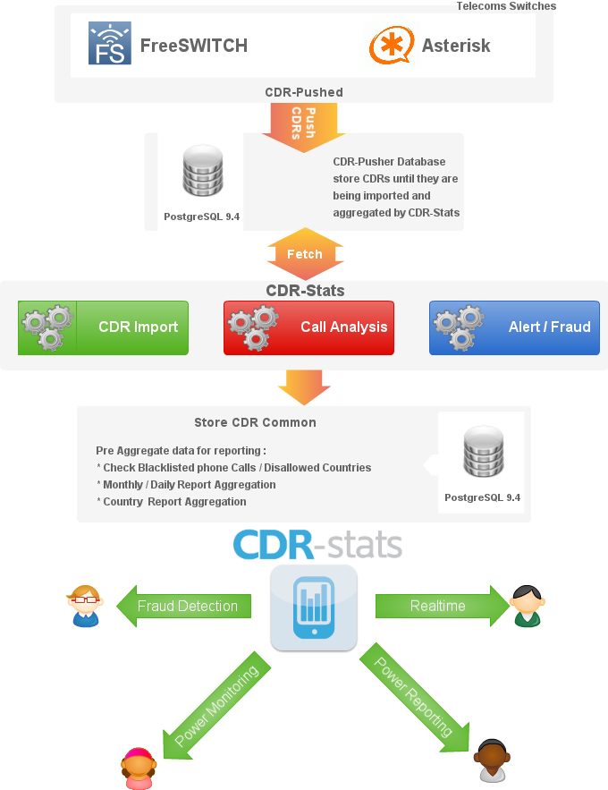

.. _getting_started:

Getting Started
===============

:Web: http://www.cdr-stats.org/
:Download: http://www.cdr-stats.org/download/
:Source: https://github.com/areski/cdr-stats/
:Keywords: VoIP, Freeswitch, Asterisk, Django, Python, Call, Reporting, CDR

--

CDR-Stats is free and open source CDR_ (Call Detail Record) mediation, rating, analysis
and reporting application for Freeswitch, Asterisk and other type of VoIP Switch.
It allows you to interrogate your CDR_ to provide reports and statistics via a
simple to use, yet powerful, web interface.

It is based on the Django_ Python Framework, Celery_, Gevent_, PostgreSQL_ and InfluxDB_.

.. contents::
    :local:
    :depth: 1

.. _overview:

Overview
--------

CDR-Stats is an application that allows rating, browsing and analysing CDR_.

Different reporting tools are provided:

- Dashboard: Overview of call activity
- Search CDR: Search, filter, display and export CDR
- Overview: Analyse call traffic by hour, day and month
- Daily Comparison: Compare call traffic day on day
- Country Report: Call statistics by country
- World Map: Call statistics overlaid on a world map
- Call Cost and Carrier Costs
- Mail daily aggregated reports
- Threat Control: Detect abnormal call patterns
- Destination Alerts: Unexpected destination alerts

CDR Stats uses PostgreSQL, a scalable, high performance database system used to
analyse large quantities of CDR data. PostgreSQL provides Materialized views
which make it perfect to build analytic application which do heavy aggregation
and recently PostgreSQL cames with Jsonb field which make it easy to store
custom data from variety of switch.

Out of the box, CDR-Stats supports Freeswitch, Asterisk, Kamailio, SipWise,
Veraz using connectors that get the CDRs and push them to centralized database.
Connectors any switch systems can be built.

For list of the last supported Switches, please refere to
http://www.cdr-stats.org/pricing/switch-connectors/

.. _screenshot_dashboard:

Dashboard
---------

User Dashboard provides realtime monitoring of the most relevant metrics of
connected switches.

.. image:: ./_static/images/customer/dashboard.png
    :width: 650

.. _screenshot_admin_panel:

Admin Panel
-----------

The Admin Panel allows the administrators to configure the entire reporting
platform, import CDR in CSV format, configure users, switch connections and
automatic alarms.

.. image:: ./_static/images/admin/admin_dashboard.png
    :width: 750

.. _architecture:

Architecture
------------

CDR-Stats uses PostgreSQL as the underlying CDR store. PostgreSQL with
Materialized view allows querying and analysis of many millions of records
without noticeable loss of performance, and can easily be scaled as
demand increases.

Postgresql is used for managing CDR-Stats in terms of users and managing
the web framework, Django.

Celery, a task manager runs in the background, and monitors the CDR coming
into the system, and alerts the systems administrator when unusual behaviour
is discovered. What is determined as unusual behaviour is determined by the
administrator who can configure alerts for increases in dropped calls,
average length of calls, or calls to unusual destinations.

CDR-Stats works hand in hand with `CDR-Pusher`_ which has been built to
create an totally independent, easy to install, high performance CDRs
Collector. CDR-Pusher is installed on your local Telcoms Switch
(e.g. Asterisk), the application will harvest CDRs in Realtime and push them
to a central CDR-Stats Database.

.. _features:

Features
--------

Many features are provided on CDR-Stats, from browsing millions of CDRs,
call rating, providing efficient search facilities to build reporting such as
monthly reports and comparing call traffic with previous days.

    +-----------------------+----------------------------------------------------+
    | Telephony Reporting   | Leading open source switches Freeswitch, Asterisk, |
    |                       | supported as standard.                             |
    +-----------------------+----------------------------------------------------+
    | Multi-switch          | Monitor traffic from many switches in one location |
    +-----------------------+----------------------------------------------------+
    | Multi-tenant          | Sllowing many customers to monitor their own CDR   |
    |                       | on one instance of CDR-Stats.                      |
    +-----------------------+----------------------------------------------------+
    | Distributed           | Runs on one or more machines. Supports             |
    |                       | broker `clustering` and `HA`. New workers  can be  |
    |                       | set up without central configuration.              |
    +-----------------------+----------------------------------------------------+
    | Fraud detection       | Visualise traffic which helps to identify unusual  |
    |                       | patterns.                                          |
    +-----------------------+----------------------------------------------------+
    | Fraud Alert           | Send emails to the administrator when fraud are    |
    |                       | or suspicious paterns occur                        |
    +-----------------------+----------------------------------------------------+
    | Error Emails          | Can be configured to send emails to the            |
    |                       | administrator if a tasks fails.                    |
    +-----------------------+----------------------------------------------------+
    | Import CDR            | Import CDR files in custom format                  |
    +-----------------------+----------------------------------------------------+
    | World Map view        | See where the traffic originates and terminates on |
    |                       | a Map                                              |
    +-----------------------+----------------------------------------------------+
    | Compare traffic       | See how your traffic evolves, and patterns change. |
    +-----------------------+----------------------------------------------------+
    | Mail Reporting        | Send daily mail reports of telecoms traffic        |
    +-----------------------+----------------------------------------------------+
    | Realtime Reporting    | Traffic displayed in realtime                      |
    +-----------------------+----------------------------------------------------+
    | Blacklist             | Blacklist Phone number patterns to receive alarms  |
    +-----------------------+----------------------------------------------------+
    | Geographic alerts     | Set alert if calls go to disallowed countries      |
    +-----------------------+----------------------------------------------------+
    | Call Rating           | Each call individually rated                       |
    +-----------------------+----------------------------------------------------+

.. _utility:

Utility
-------

CDR-Stats is a simple-to-use tool to provide easy  rating and analysis of calls.
It is a recommended addition to telephony servers, whether it be a simple in-house
PBX or large capacity VoIP switch. It shows in in near realtime what calls are going
through, can detect errors and failures, and alert the systems administrator is
unexpected traffic is noted.

.. _`CDR`: http://en.wikipedia.org/wiki/Call_detail_record
.. _`Freeswitch`: http://www.freeswitch.org/
.. _`Asterisk`: http://www.asterisk.org/
.. _`Django`: http://djangoproject.com/
.. _`Celery`: http://www.celeryproject.org/
.. _`Gevent`: http://www.gevent.org/
.. _`PostgreSQL`: http://www.postgresql.org/
.. _`InfluxDB`: http://influxdb.com/
.. _`CDR-Pusher`_: https://github.com/areski/cdr-pusher
