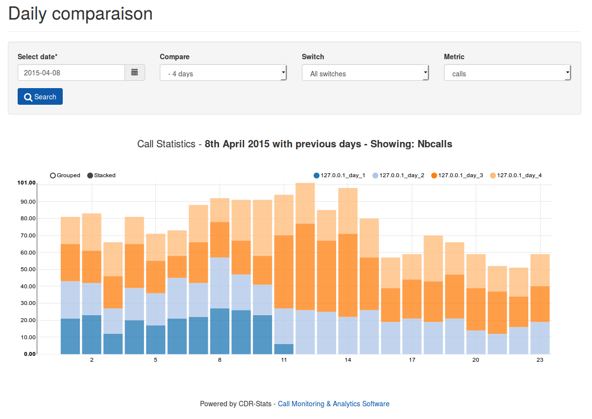

.. _installation-overview:

========
Overview
========

CDR-Stats is a web-based telecoms application for analysing, reporting and rating on CDR (Call Detail Records) for multiple tenants delivered from Asterisk, Freeswitch and other supported telecoms switches.

CDR-Stats is built on Open Source Software where the core components are Django, PostgreSQL, Celery, Redis, Socket.IO, Bower and Bootstrap Framework. There are many more Python and Django dependencies needed but if you are not a developer, you might want to skip those details as CDR-Stats can simply be installed using a script which installs transparently and seamlessly, CDR-Stats and the stack for you.

.. _install-requirements:

Install requirements
====================

The `requirements` files provides a way to create an environment where all
the dependencies needed for the CDR-Stats are installed.

To get started with CDR-Stats the following must be installed:

- python >= 2.7 (programming language)
- nginx - Http Server
- django Framework >= 1.7 (Python based Web framework)
- celery >= 3.0 (Asynchronous task queue/job queue based on distributed message passing)
- linaro_django_pagination (Utilities for creating robust pagination tools throughout a django application)
- django-uuidfield >= 0.2 (Provides a UUIDField for your Django models)
- kombu >= 1.0.2 (An AMQP - Advanced Message Queuing Protocol messaging framework for Python)
- python-dateutil >= 1.5 (Extensions to the standard datetime module)
- redis >= 2.2.2 (Redis Python Client)
- django-notification >= 0.1.3 (User notification management for the Django web framework)
- django-country-dialcode - Django reusable application to manage Dial code of Countries

and many more, please find a full list of our requirements to our requirements files:

- https://github.com/cdr-stats/cdr-stats/blob/develop/requirements/basic.txt
- https://github.com/cdr-stats/cdr-stats/blob/develop/requirements/django.txt

There is also 2 extra requirements files for developers and to run our tests:

- https://github.com/cdr-stats/cdr-stats/blob/develop/requirements/dev.txt
- https://github.com/cdr-stats/cdr-stats/blob/develop/requirements/test.txt

The requirements must be installed into a virtual environement so that the
dependencies of the application do not interfere with other applications on the
server. More information can be found about virtualenv at:
http://pypi.python.org/pypi/virtualenv

PIP is a tool for installing and managing Python packages, more information
about PIP : http://www.pip-installer.org/en/latest/index.html

Using PIP, you can easily install all the requirements::

    $ pip install -r requirements/all.txt

.. _running-cdrstats:

Running CDR-Stats manually
==========================

Inside CDR-Stats directory you should run, the following::

    $ python manage.py syncdb --noinput

    $ python manage.py collectstatic

    $ python manage.py migrate

    $ python manage.py createsuperuser

    $ python manage.py runserver

``syncdb`` will create a database named test.db in ``database`` folder of the
CDR-Stats directory. CDR-Stats is configured to do this, but can be changed
by modifying settings.py where the DATABASES dictionary is constructed. there
is  more information about this in the Django documentation.

``collectstatic`` will fetch all necessary media files and put them into
``static`` folder defined in the settings module.

``migrate`` will applying database migration to update the database schemas of CDR-Stats to its latest version.

``createsuperuser`` will create a super user, to access to the admin section of CDR-Stats.

``runserver`` runs an embedded webserver to test the site.
By default it will run on http://localhost:8000. This is configurable and more
information about ``runserver`` is in Django documentation.

