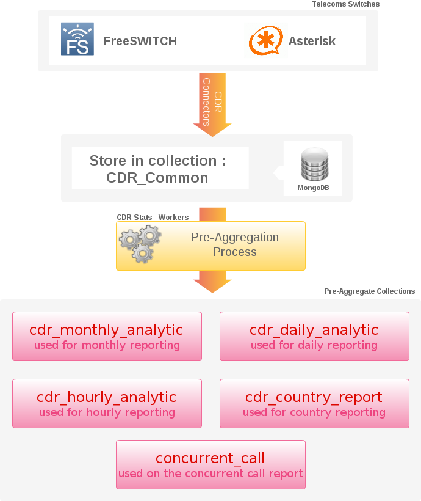

.. _mongodb:

MongoDB
=======

:Web: http://www.mongodb.org/
:Download: http://www.mongodb.org/downloads/

--

MongoDB is a scalable, high-performance, document-oriented schemaless database.  
MongoDB is a Document-oriented datastore, everything in MongoDB is a document. 
Because MongoDB is document-oriented, it is schema-less. There is no notion of a rigid 
table structure composed of columns and types. Because data in mongo is stored as documents, there are no joins. 

.. contents::
    :local:
    :depth: 1

.. _why_mongodb:

Why MongoDB
-----------

Why did we choose MongoDB and what are the benefits, to answer this questions I think we should enumarete some of the major features of MongoDB.

**Document-oriented**:
    * Documents (objects) map nicely to programming language data types
    * Embedded documents and arrays reduce need for joins
    * Dynamically-typed (schemaless) for easy schema evolution
    
**High performance**:
    * No joins and embedding makes reads and writes fast
    * Indexes including indexing of keys from embedded documents and arrays
    
    
**High availability**:
    * Replicated servers with automatic master failover
    

A more detailed list of everything provided by mongoDB can be found at 
http://www.mongodb.org/display/DOCS/Introduction

As MongoDB is a Document-oriented datastore, it had a huge potentiel to store 
CDRs, Call Details Record vary in times, and from a Telecom Switch to an other 
you will certainly find yourself dealing with different type of data in 
different format. For this reasons a NoSQL is a very good candidate for a CDR warehouse.

.. _datastore_architecture:

Datastore Architecture
----------------------
 
The MongoDB aggregation framework provides a means to calculate aggregate 
values without having to use Map-reduce (http://www.mongodb.org/display/DOCS/MapReduce). 
For those familiar with SQL, the aggregation framework can be used to do 
the kind of thing that SQL does with group-by and distinct, as well as 
some simple forms of self-joins.

The aggregation framework also provides projection facilities that can be 
used to reshape data. This includes the ability to add computed fields, to 
create new virtual sub-objects, and to extract sub-fields and bring them to 
the top-level of results.

**update()** replaces the document matching criteria entirely with objNew. 

Shell syntax for update(): db.collection.update(criteria, objNew, upsert, multi)

Arguments:
    * **criteria** - query which selects the record to update
    * **objNew** - updated object or $ operators (e.g., $inc) which manipulate the object
    * **upsert** - if this should be an "upsert" operation; that is, if the record(s) do not exist, insert one. Upsert only inserts a single document.
    * **multi** - indicates if all documents matching criteria should be updated rather than just one. Can be useful with the $ operators below.

Shell syntax for $inc: { $inc : { field : value } }
Increments “field” by the number “value” if “field” is present in the object, 
otherwise sets “field” to the number “value”. This can also be used to 
decrement by using a negative “value”.

**1) cdr_common:** 
    To collect all cdrs from different switches & store into one common format which includes following fields 
    switch_id,  caller_id_number, caller_id_name, destination_number, duration, billsec, hangup_cause_id, accountcode, direction, uuid, remote_media_ip, start_uepoch, answer_uepoch, end_uepoch, mduration,
    billmsec, read_codec, write_codec, cdr_type, cdr_object_id, country_id, authorized.
    This cdr_common collection used to view cdr records on customer panel 

**2) cdr_monthly_analytic:**
    To collect monthly analytics from cdrs which includes following fields 
    start_uepoch, destination_number, hangup_cause_id, accountcode, switch_id, calls, duration.
    This cdr_monthly_analytic collection used to view monthly graph on customer panel
 
**3) cdr_daily_analytic:**
    To collect daily analytics from cdrs which includes following fields start_uepoch,
    destination_number, hangup_cause_id, accountcode, switch_id, calls, duration.
    This cdr_daily_analytic collection used to view daily graph on customer panel.

**4) cdr_hourly_analytic:**
    To collect hourly analytics from cdrs which includes following fields 
    start_uepoch, destination_number, hangup_cause_id, accountcode, switch_id, calls, duration.
    This cdr_hourly_analytic collection used to view hourly graph on customer panel 

**5) cdr_country_report:**
    To collect country vise analytics from cdr which includes following fields 
    start_uepoch, country_id, accountcode, switch_id, calls, duration.
    This cdr_country_report collection used to view country graph on customer panel 

**6) concurrent_call:**
    To collect concurrent calls which includes following fields 
    switch_id, call_date, numbercall, accountcode.
    This concurrent_call collection used to view concurrent call real-time graph on customer panel 

