.. _admin-panel:

Admin Panel
===========

The Admin section allows you to create administrators who have access the admin screens. Levels of
access can be set.

The Admin UI is located at http://localhost:8000/admin/

.. contents::
    :local:
    :depth: 1

.. _admin-panel-dashboard:

Dashboard
---------

Dashboard page for the admin interface after successful login with superuser credentials

.. image:: ../_static/images/admin/admin_dashboard.png

.. _admin-panel-cdr-import:

CDR Manual Import / Export
--------------------------

There is a tool in CDR-Stats to manually import CDRs from CSV, JSON, Excel & YAML.
The first line of the import file should contain the following header names "switch,cdr_source_type,callid,caller_id_number,caller_id_name,destination_number,dialcode,state,channel,starting_date,duration,billsec,progresssec,answersec,waitsec,hangup_cause_id,hangup_cause,direction,country_code,accountcode,buy_rate,buy_cost,sell_rate,sell_cost,extradata".

Example of a CDR csv file to import:
::

    switch,cdr_source_type,callid,caller_id_number,caller_id_name,destination_number,dialcode,state,channel,starting_date,duration,billsec,progresssec,answersec,waitsec,hangup_cause_id,hangup_cause,direction,country_code,accountcode,buy_rate,buy_cost,sell_rate,sell_cost,extradata
    127.0.0.1,1,96aa82fe-7bd1-11e5-a230-5c514f6a0f72,904151440,CallerIDName,+34798400122,34,,,2015-10-21 12:13:10,55,50,,,,16,,1,,1000,,,,,{}
    127.0.0.1,1,c9135e4a-7bd1-11e5-a230-5c514f6a0f72,904234320,CallerIDName,+34798401111,34,,,2015-10-21 12:33:15,15,10,,,,16,,1,,1000,,,,,{}
    127.0.0.1,1,cfaf8b56-7bd1-11e5-a230-5c514f6a0f72,901110380,CallerIDName,+34650104877,34,,,2015-10-21 12:53:16,41,34,,,,16,,1,,1000,,,,,{}
    127.0.0.1,1,3c64a168-7bd2-11e5-a230-5c514f6a0f72,904234320,CallerIDName,+34798401111,34,,,2015-10-21 12:53:16,16,11,,,,16,,1,,1000,,,,,{}
    127.0.0.1,1,41b20dd9-7bd2-11e5-a230-5c514f6a0f72,904231111,CallerIDName,+34650104877,34,,,2015-10-21 12:53:16,8,5,,,,16,,1,,1000,,,,,{}

Note:
::

    - cdr_source_type is an integer to define from where the CDR comes from (UNKNOWN = 0, CSV = 1, API = 2, FREESWITCH = 3, ASTERISK = 4, YATE = 5, KAMAILIO = 6, OPENSIPS = 7, SIPWISE = 8, VERAZ = 9)

    - extradata is a JSON field, if empty you have to set it as `{}`

From CDR Import admin page, you will also be able to export your CDRs to CSV, JSON, HTML, ODS, Excel & YAML.

**URL**:

    * http://localhost:8000/admin/import_cdr/cdrimport/import/
    * http://localhost:8000/admin/import_cdr/cdrimport/export/

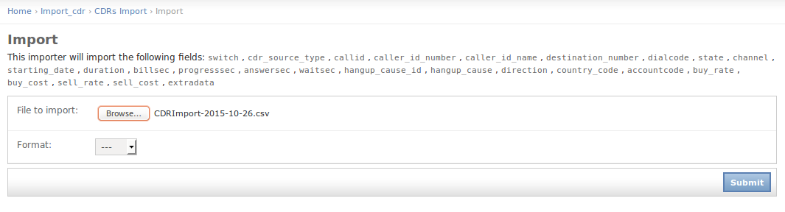

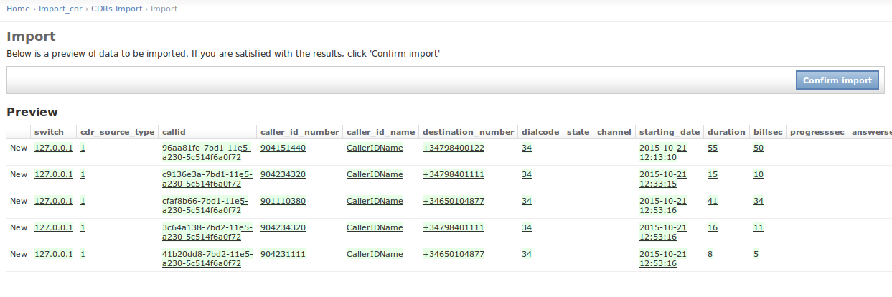

.. _admin-panel-alarm:

Alarm
-----

The alarm list will be displayed from the following URL. You can add a new
alarm by clicking ``Add alarm`` and adding the name of the alarm and its
description, Also from the alarm list, click on the alarm that you want
to update.

**URL**:

    * http://localhost:8000/admin/cdr_alert/alarm/

.. image:: ../_static/images/admin/alarm_list.png

To Add/Update alarm

**URL**:

    * http://localhost:8000/admin/cdr_alert/alarm/add/
    * http://localhost:8000/admin/cdr_alert/alarm/1/

.. image:: ../_static/images/admin/add_alarm.png

.. _admin-panel-alarm-report:

Alarm-report
------------

The alarmreport will be displayed from the following URL.

**URL**:

    * http://localhost:8000/admin/cdr_alert/alarmreport/

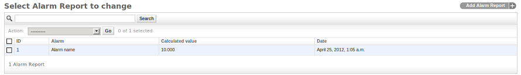

To Add/Update alarmreport

**URL**:

    * http://localhost:8000/admin/cdr_alert/alarmreport/add/
    * http://localhost:8000/admin/cdr_alert/alarmreport/1/

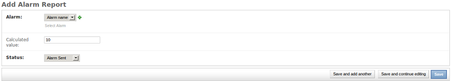

.. _admin-panel-blacklist:

Blacklist
---------

The blacklist will be displayed from the following URL. You can add a new
blacklist by clicking ``Blacklist by country`` and selecting the country name and its
prefixes, Also from the blacklist, click on the blacklist that you want
to update.

**URL**:

    * http://localhost:8000/admin/cdr_alert/blacklist/

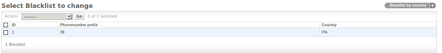

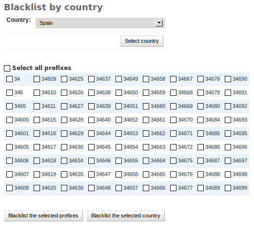

.. _admin-panel-whitelist:

Whitelist
---------

The whitelist will be displayed from the following URL. You can add a new
Whitelist by clicking ``Whitelist by country`` and selecting the country name and its
prefixes, Also from the whitelist, click on the blacklist that you want
to update.

**URL**:

    * http://localhost:8000/admin/cdr_alert/whitelist/

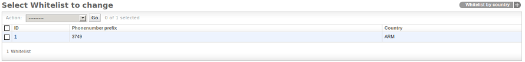

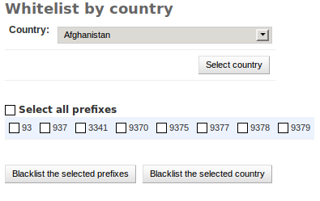

.. _admin-panel-alert-remove-prefix:

Alert-remove-prefix
-------------------

The alert remove prefix will be displayed from the following URL. You can add a new
remove prefix by clicking ``Add alert remove prefix`` and selecting the remove prefix,
Also from the alert remove prefix, click on the remove prefix that you want to update.

The Admin UI is located at http://localhost:8000/

**URL**:

    * http://localhost:8000/admin/cdr_alert/alertremoveprefix/

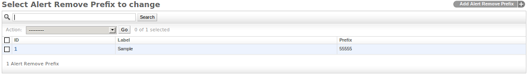

To Add/Update alert-remove prefix

**URL**:

    * http://localhost:8000/admin/cdr_alert/alertremoveprefix/add/
    * http://localhost:8000/admin/cdr_alert/alertremoveprefix/1/

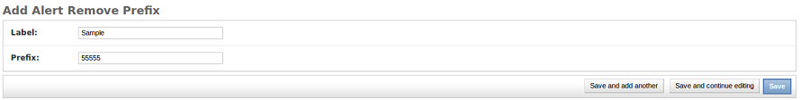

.. _admin-panel-switch:

Switch
------

**URL**:

    * http://localhost:8000/admin/cdr/switch/

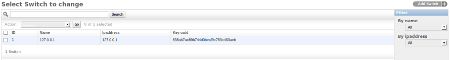

.. _admin-panel-hangupcause:

HangupCause
-----------

**URL**:

    * http://localhost:8000/admin/cdr/hangupcause/

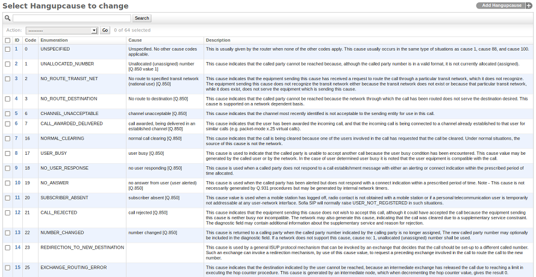

.. _admin-panel-cdr-view:

CDR View
--------

**URL**:

    * http://localhost:8000/admin/cdr/switch/cdr_view/

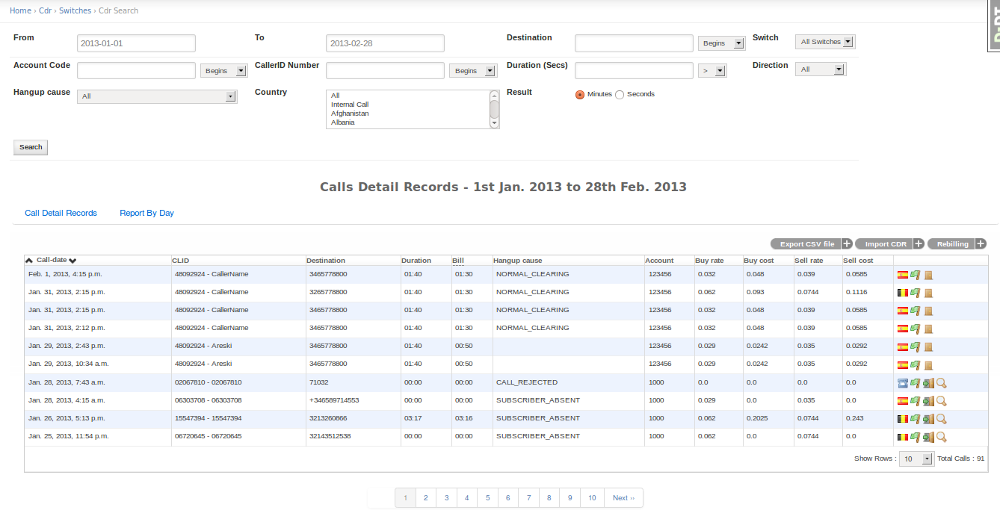
