.. _customer-panel:

==============
Customer Panel
==============

User Interface :

This application provides a user interface...

http://localhost:8000/

.. contents::
    :local:
    :depth: 1

.. _customer-screenshot-features:

Screenshot with Features
========================

Index
~~~~~

Index page for the customer interface after successful login with user credentials

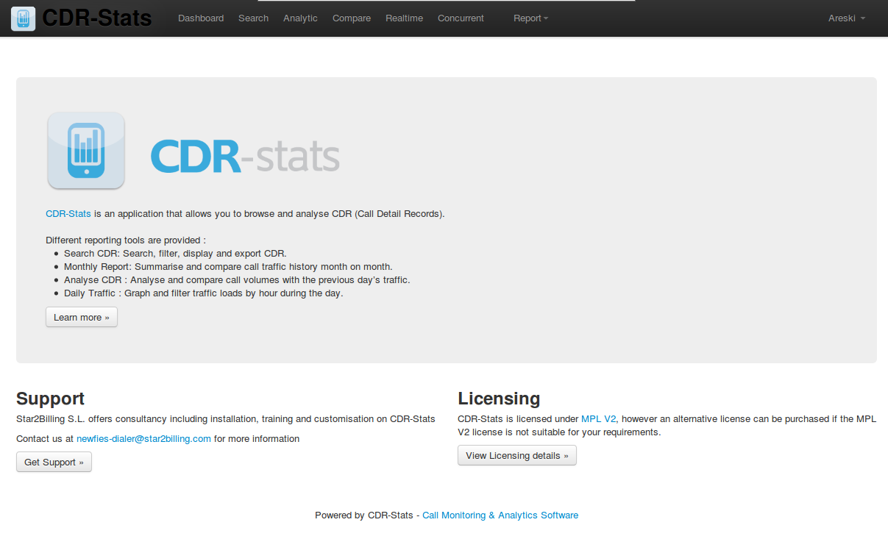

Dashboard
~~~~~~~~~

The dashboard displays a graphical representation of the last 24 hours calls, call status statistics
and calls by country, either agregrated for all switches, or selectable by switch.

**URL**:

    * http://localhost:8000/dashboard/

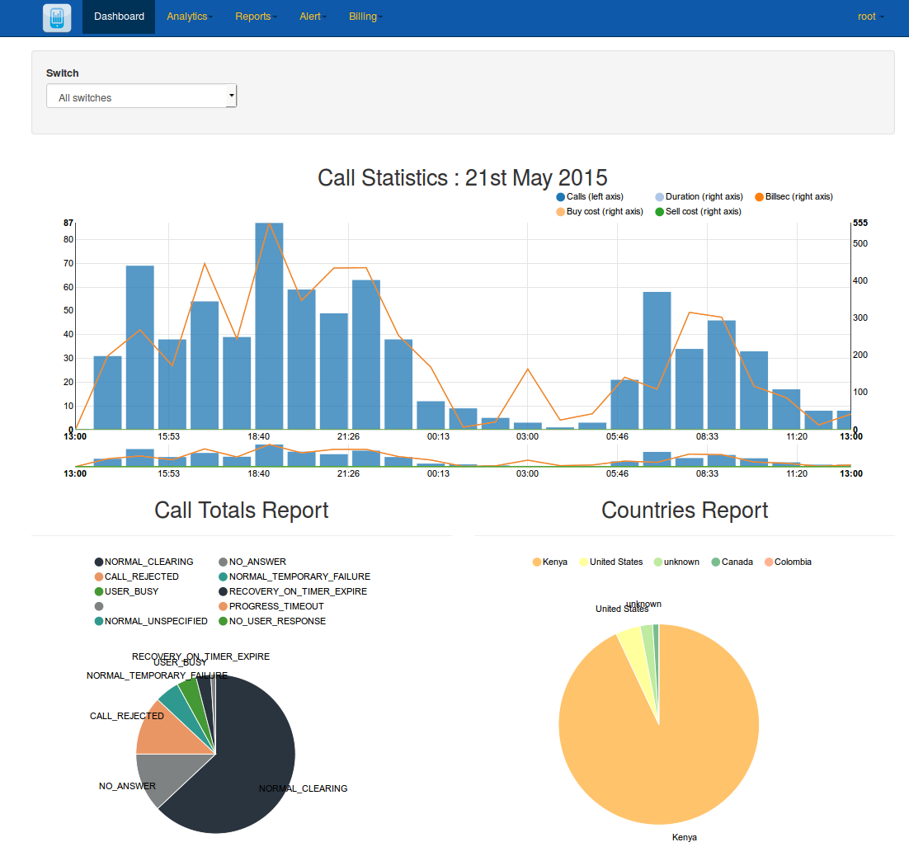

CDR-View
~~~~~~~~

Call detail records listed in table format which can be exported to CSV file. 

Advanced Search allows further filtering and searching on a range of criteria

The Report by Day shows a graphical illustration of the calls, minutes and average call time.

**URL**:

    * http://localhost:8000/cdr_view/

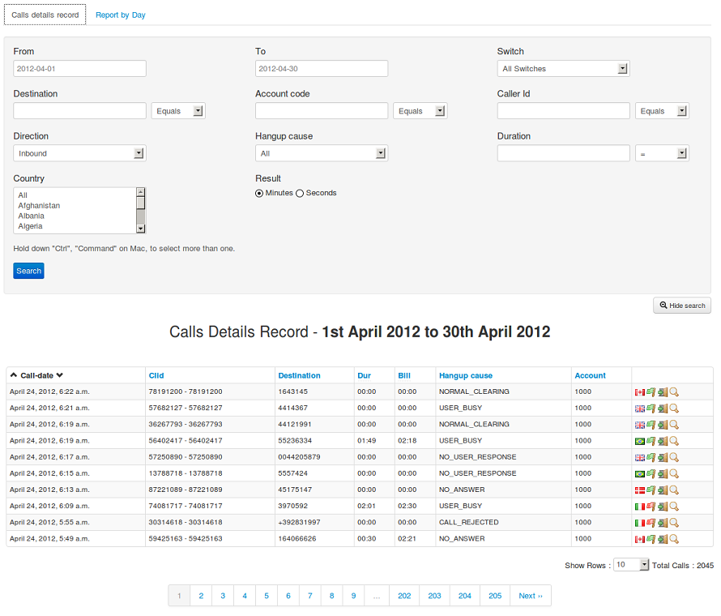

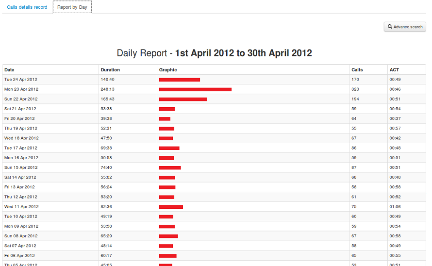

CDR-Overview
~~~~~~~~~~~~

A pictorial view of calls with call-count or call-duration from any date or date-range

**URL**:

    * http://localhost:8000/cdr_overview/

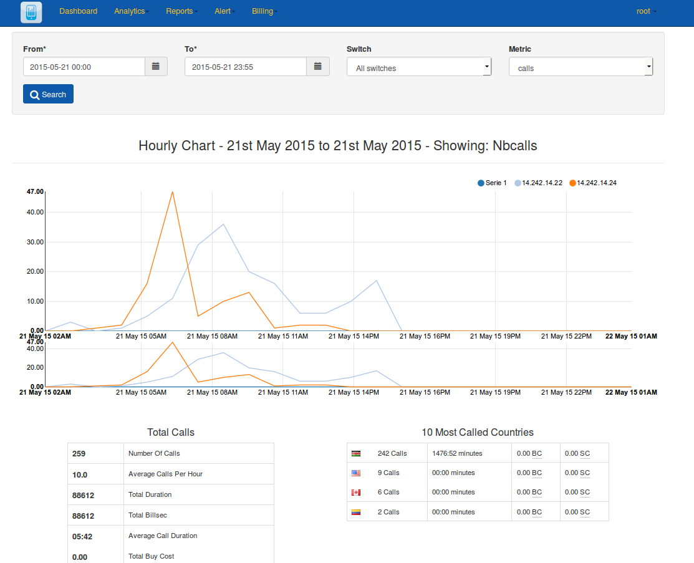

CDR-Hourly-Report
~~~~~~~~~~~~~~~~~

An hourly pictorial view of calls with call-count & call-duration.
You can compare different dates

**URL**:

    * http://localhost:8000/hourly_report/

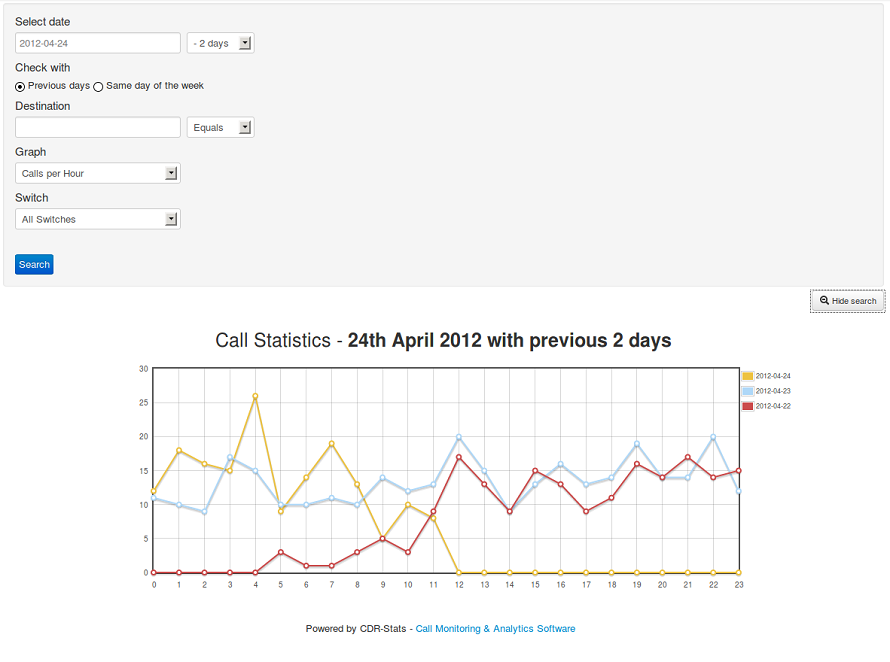

CDR-Country-Report
~~~~~~~~~~~~~~~~~~

A pictorial view of all calls by country with the 10 most called countries in a pie chart.

**URL**:

    * http://localhost:8000/country_report/

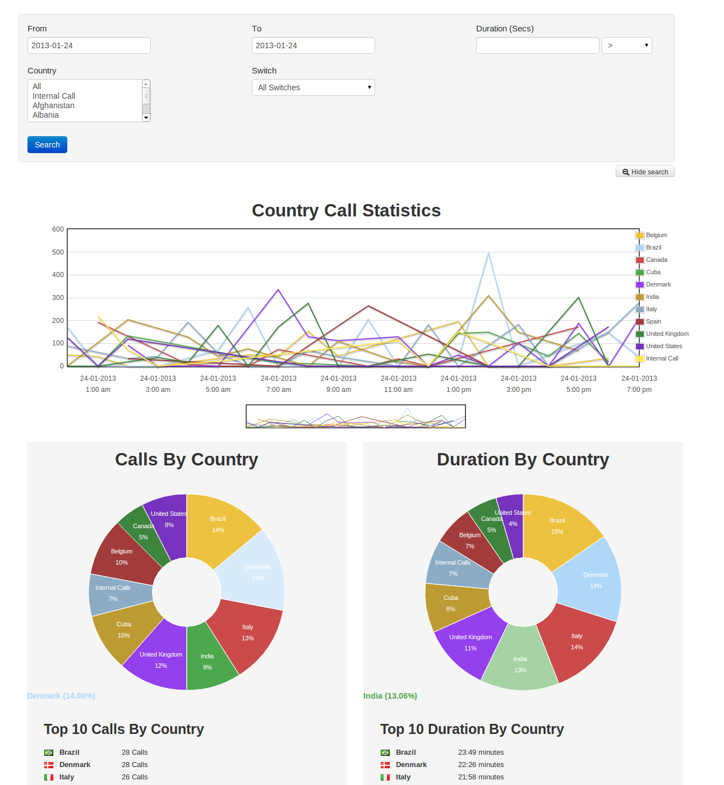

Mail-Report
~~~~~~~~~~~

A list of the last 10 calls of the previous day, along with total calls, a
breakdown of the call status, and the top 5 countries called.

This report is emailed automatically, email recipients can be set up in the 
admin section or by adding an email address in the "Email to send a report" field
in the Mail Report section.

**URL**:

    * http://localhost:8000/mail_report/

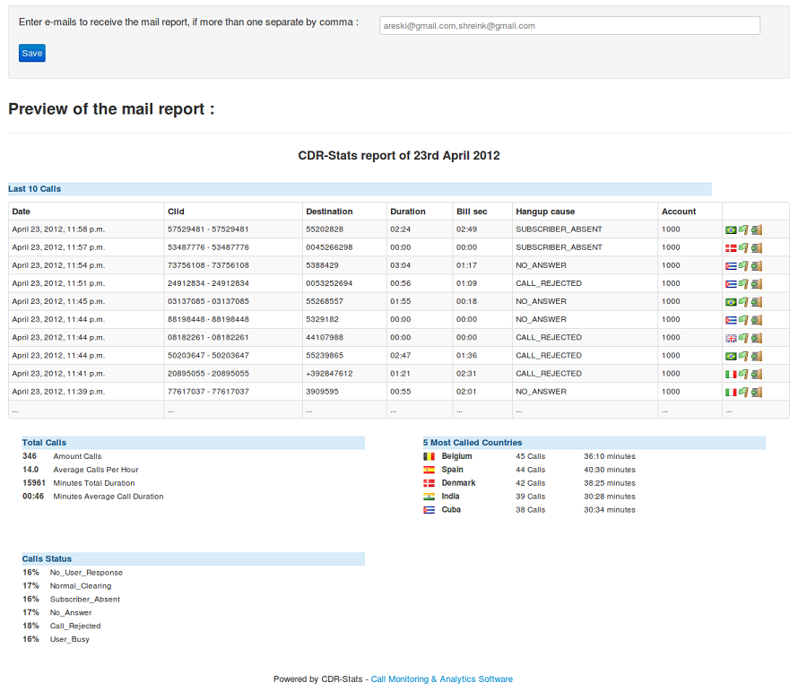

Concurrent-call-report
~~~~~~~~~~~~~~~~~~~~~~

A report of concurrent calls. The statistics are collated from the realtime
report, not from the CDR.

**URL**:

    * http://localhost:8000/cdr_concurrent_calls/

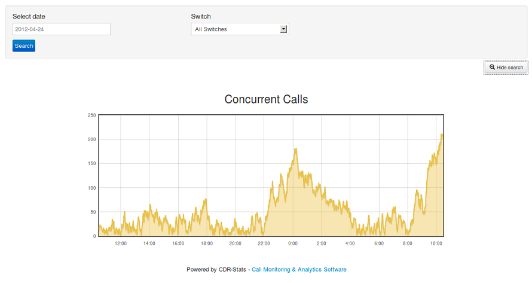

Realtime-Report
~~~~~~~~~~~~~~~

Realtime monitoring of the traffic on the connected telecoms servers, 
Freeswitch and Asterisk are supported.

**URL**:

    * http://localhost:8000/cdr_realtime/

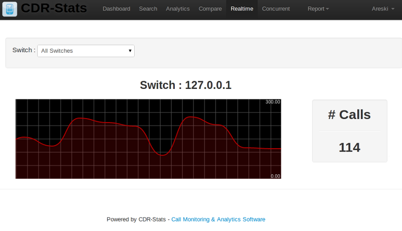

World Map Report
~~~~~~~~~~~~~~~~

A distriibution map of all calls / durations by country. You can select date criteria
and on mouse over on the world map you can get information about each country.

**URL**:

    * http://localhost:8000/world_map/

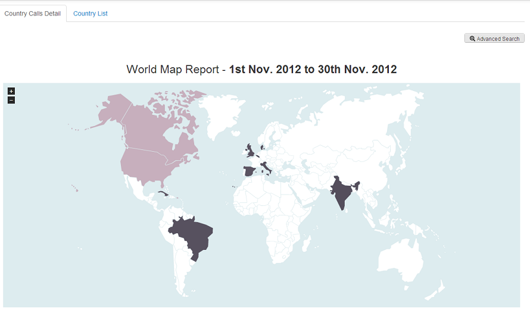

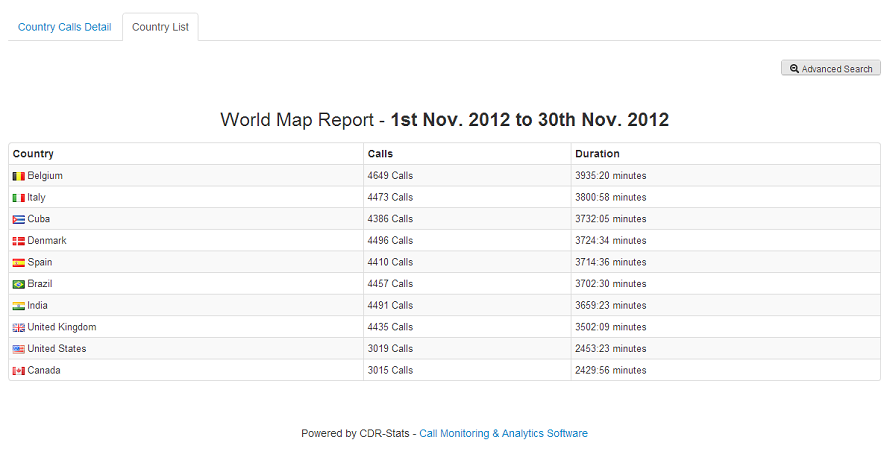

Alert Settings
~~~~~~~~~~~~~~

**URL**:

    * http://localhost:8000/alert/

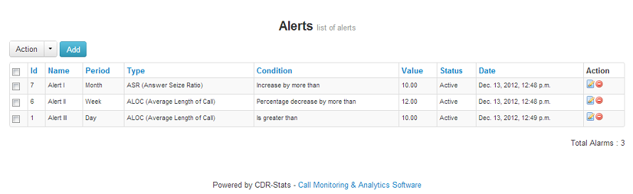

Alert Report
~~~~~~~~~~~~

**URL**:

    * http://localhost:8000/alert_report/

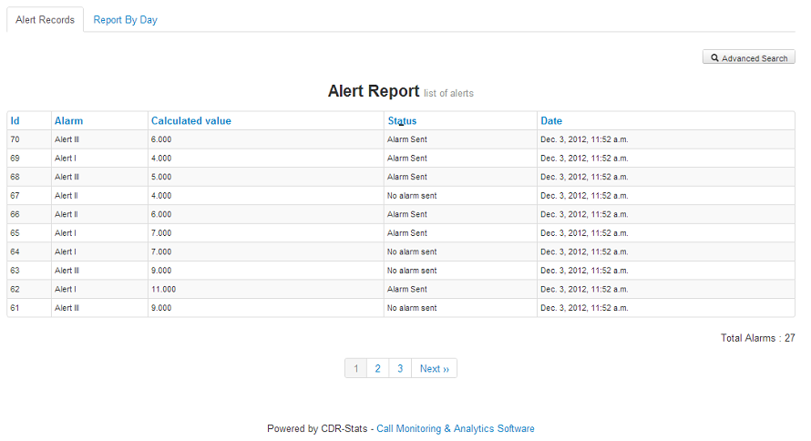

Destination Control
~~~~~~~~~~~~~~~~~~~

**URL**:

    * http://localhost:8000/trust_control/

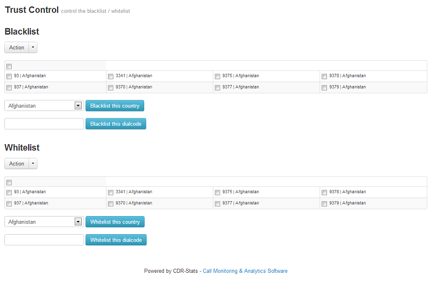

Diagnostic CDR-Stats
~~~~~~~~~~~~~~~~~~~~

**URL**:

    * http://localhost:8000/diagnostic/

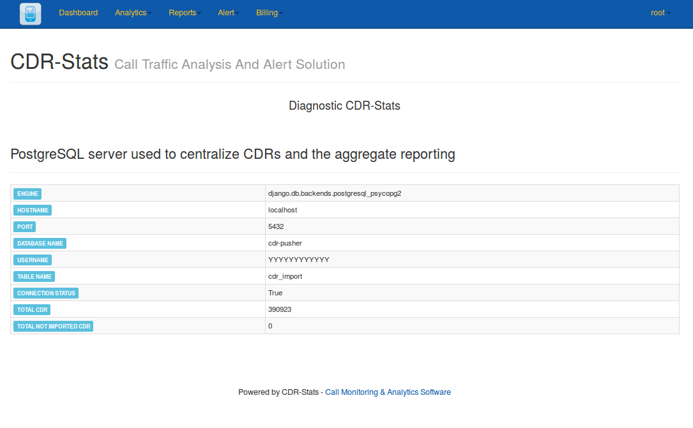