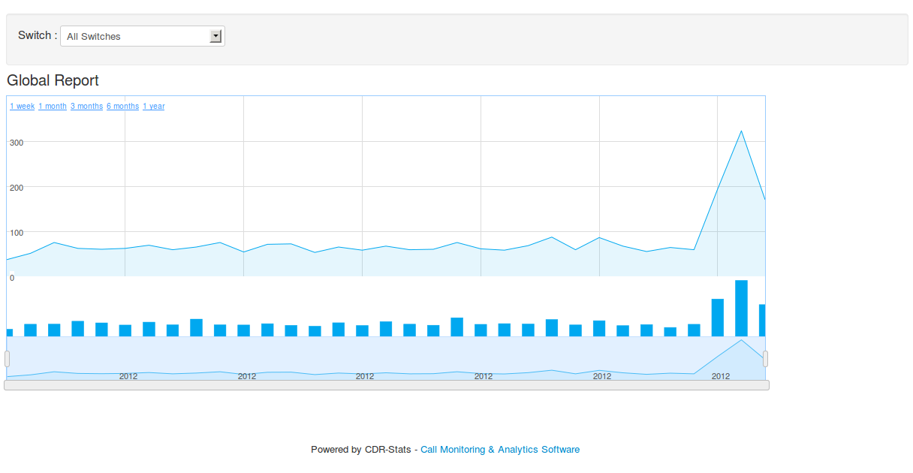

.. _customer-panel:

==============
Customer Panel
==============

User Interface :

This application provides a user interface...

http://localhost:8000/

.. contents::
    :local:
    :depth: 1

.. _customer-screenshot-features:

Screenshot with Features
========================

Index
~~~~~

Index page for the customer interface after successful login with user credentials

.. image:: ../_static/images/customer/index.png
    :width: 1000

Dashboard
~~~~~~~~~

In this view, you can get pictorial view of current date's calls and their
call status statistics along with countries call statistics

**URL**:

    * http://localhost:8000/dashboard/

.. image:: ../_static/images/customer/dashboard.png
    :width: 1000

CDR-View
~~~~~~~~

In this view, you can get list of all call records in table format with day vise total
call-count/call-duration detail in display

**URL**:

    * http://localhost:8000/cdr_view/

.. image:: ../_static/images/customer/cdr_view_I.png
    :width: 1000

.. image:: ../_static/images/customer/cdr_view_II.png
    :width: 1000

CDR-Overview
~~~~~~~~~~~~

In this view, you can get pictorial view of calls with call-count or call-duration
from any date or date-range

**URL**:

    * http://localhost:8000/cdr_overview/

.. image:: ../_static/images/customer/cdr_overview.png
    :width: 1000

CDR-Hourly-Report
~~~~~~~~~~~~~~~~~

In this view, you can get hourly pictorial view of calls with call-count & call-duration.
You can compare different dates

**URL**:

    * http://localhost:8000/hourly_report/

.. image:: ../_static/images/customer/call_compare.png
    :width: 1000

CDR-Global-Report
~~~~~~~~~~~~~~~~~

In this view, you can get pictorial view of all calls

**URL**:

    * http://localhost:8000/global_report/

CDR-Country-Report
~~~~~~~~~~~~~~~~~~

In this view, you can get pictorial view of all calls country vise. Also
you can have 10 most called countries name with pie chart

**URL**:

    * http://localhost:8000/country_report/

.. image:: ../_static/images/customer/country_report.png
    :width: 1000

Mail-Report
~~~~~~~~~~~

In this view, you can get report of last 10 calls of previous day. Also
you can have total calls, call status & 5 most called countries detail

**URL**:

    * http://localhost:8000/mail_report/

.. image:: ../_static/images/customer/mail_report.png
    :width: 1000

Concurrent-call-report
~~~~~~~~~~~~~~~~~~~~~~

In this view, you can get report of concurrent calls

**URL**:

    * http://localhost:8000/cdr_concurrent_calls/

.. image:: ../_static/images/customer/concurrent_call.png
    :width: 1000

Realtime-Report
~~~~~~~~~~~~~~~

**URL**:

    * http://localhost:8000/cdr_realtime/

